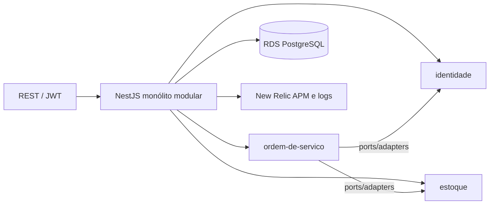

# app — API da oficina (Fase 3)

Código que **roda no Amazon EKS**: ordens de serviço, clientes, veículos, catálogo, estoque, login da equipe e validação do JWT emitido pela Lambda.

**Comece por aqui se for avaliar:** [`docs/arquitetura.md`](docs/arquitetura.md) — mapa do enunciado, diagramas, RFCs, ADRs e links de produção.

Os outros três repositórios:

- [lambda-auth](https://github.com/tech-challenge-pos-fiap-debora/lambda-auth) — login por CPF (API Gateway + Lambda)
- [infra-kubernetes](https://github.com/tech-challenge-pos-fiap-debora/infra-kubernetes) — EKS, ALB, HPA, New Relic
- [infra-database](https://github.com/tech-challenge-pos-fiap-debora/infra-database) — RDS PostgreSQL

## Produção (clicar)

| O quê | URL |
|---|---|
| Swagger | http://k8s-techchal-api-3be88fc582-917637512.us-east-1.elb.amazonaws.com/api |
| Health | http://k8s-techchal-api-3be88fc582-917637512.us-east-1.elb.amazonaws.com/health/live |
| Login cliente (CPF) | `POST` https://b831ifscuh.execute-api.us-east-1.amazonaws.com/prod/auth/login |
| New Relic (dashboards / APM / logs) | https://one.newrelic.com/redirect/entity/ODUwODAzNnxWSVp8REFTSEJPQVJEfGRhOjEzMTY1ODM5 |

CPF de demonstração: `52998224725`. Sem Bearer nas rotas internas → `401`. JWT de cliente em rota de equipe → `403`.

## Tecnologias

- Node.js 22, TypeScript, NestJS 11
- PostgreSQL (TypeORM + `pg`), migrations em `migrations/sql/`
- JWT (Passport): equipe e `role=cliente` da Lambda
- Docker (targets `production` e `migrations`)
- New Relic (agente `node -r newrelic`)
- Jest

## Diagrama deste repositório



Nuvem completa: [`docs/diagrams/componentes-nuvem.md`](docs/diagrams/componentes-nuvem.md).

## APIs

- Equipe: `POST /auth/login` `{ "email", "password" }` no ALB
- Cliente: API Gateway (`lambda-auth`), depois `Authorization: Bearer`
- Health: `GET /health/live`, `GET /health/ready`
- Roteiro de OS: [`docs/api-fluxo-fase-2-endpoints.md`](docs/api-fluxo-fase-2-endpoints.md)

## Execução local

```bash
cp .env.example .env
docker compose up -d --build
yarn migrate:up
```

- http://localhost:3000/api — Swagger
- Seed: `admin@local.dev` / `SEED_ADMIN_PASSWORD` do `.env`

```bash
yarn test
yarn test:integration
yarn build
```

## Deploy e pipeline

Push na `main` (só via PR) → [`publish-ecr.yml`](.github/workflows/publish-ecr.yml) publica no ECR e dispara o `Deploy Prod` do `infra-kubernetes`.

| Workflow | Gatilho | O que faz |
|---|---|---|
| [`ci.yml`](.github/workflows/ci.yml) | PR e `main` | testes + build |
| [`publish-ecr.yml`](.github/workflows/publish-ecr.yml) | `main` | ECR + deploy EKS |
| [`cd.yml`](.github/workflows/cd.yml) | manual | Kind da Fase 2 — **não é produção** |

## Fases 1 e 2 (histórico)

- [`readme/fase-1.md`](readme/fase-1.md) — Compose local
- [`readme/fase-2.md`](readme/fase-2.md) — Kind
- Vídeo antigo (Kind/HPA): [Google Drive](https://drive.google.com/drive/folders/1lh3C0epIgxDlT67pXlC3IdDHHwV4oc2z?usp=sharing)

O vídeo da **Fase 3** (CPF, CI/CD, APIs, New Relic) vai no PDF do portal.

**Licença:** UNLICENSED (projeto acadêmico).
