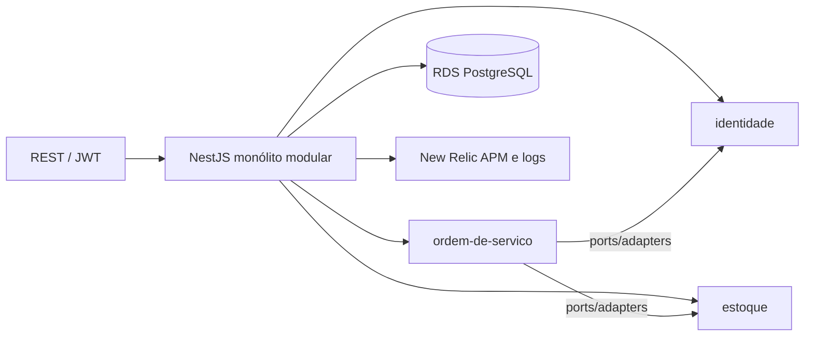

# app — API da oficina

## Propósito

Aplicação principal da oficina mecânica. Roda no Amazon EKS: ordens de serviço, clientes, veículos, catálogo, estoque, login interno e validação do JWT emitido pela Lambda. É o quarto repositório exigido pelo Tech Challenge (código que executa no Kubernetes).

Documentação arquitetural da Fase 3: [`docs/arquitetura.md`](docs/arquitetura.md).

Fases anteriores: [`readme/fase-1.md`](readme/fase-1.md), [`readme/fase-2.md`](readme/fase-2.md) (Kind + Mongo local — **Fase 3 usa RDS PostgreSQL**).

## Tecnologias

- Node.js 22, TypeScript, NestJS 11
- PostgreSQL via TypeORM (ou Prisma) + driver `pg`
- JWT (Passport) para equipe e para o token `role=cliente` da Lambda
- Docker (imagem `production` e `migrations`)
- New Relic (APM, logs JSON, eventos de negócio)
- Jest (unitário e integração)

## Pré-requisitos

- Node 22 e Yarn
- Docker e Docker Compose, para o caminho local (Postgres no compose)
- Cluster do `infra-kubernetes` e `DATABASE_URL` do RDS, para produção
- Secrets no GitHub: `AWS_ACCESS_KEY_ID`, `AWS_SECRET_ACCESS_KEY`, `AWS_SESSION_TOKEN`, `INFRA_DISPATCH_TOKEN` (opcional)

## Execução local

```bash
cp .env.example .env
docker compose up -d --build
yarn migrate:up
```

- API: http://localhost:3000
- Swagger: http://localhost:3000/api
- Seed: `admin@local.dev` / senha do `.env` (`SEED_ADMIN_PASSWORD`)

Sem Compose: Postgres local, `yarn migrate:up`, `yarn start:dev`.

```bash
yarn test
yarn test:integration
yarn build
```

## Deploy

A `main` publica imagens no ECR e dispara o workflow `Deploy Prod` do `infra-kubernetes`.

```bash
# feito pelo GitHub Actions em .github/workflows/publish-ecr.yml
docker build --target production -t tech-challenge-api:local .
docker build --target migrations -t tech-challenge-api-migrations:local .
```

O Deployment no EKS inicia com `node -r newrelic dist/main.js`. Sem `NEW_RELIC_LICENSE_KEY` a telemetria é no-op.

## Pipeline

| Workflow | Gatilho | O que faz |
|---|---|---|
| [`ci.yml`](.github/workflows/ci.yml) | PR e push na `main` | `yarn test`, `yarn test:integration`, `yarn build` |
| [`publish-ecr.yml`](.github/workflows/publish-ecr.yml) | push na `main` | build/push ECR + `gh workflow run` no `infra-kubernetes` |
| [`cd.yml`](.github/workflows/cd.yml) | manual | Kind da Fase 2 (legado; não é produção) |

A `main` é protegida: só entra alteração por Pull Request.

## Diagrama deste repositório



Visão de nuvem: [`docs/diagrams/componentes-nuvem.md`](docs/diagrams/componentes-nuvem.md).

## APIs

- Swagger: http://localhost:3000/api (local) ou `https://<alb>/api` depois do deploy
- OpenAPI JSON: http://localhost:3000/api-json
- Login de equipe: `POST /auth/login` `{ "email", "password" }`
- Login de cliente: API Gateway do `lambda-auth`, depois Bearer nas rotas com `@AuthRoles`
- Health: `GET /health/live`, `GET /health/ready`

Roteiros: [`docs/api-fluxo-fase-2-endpoints.md`](docs/api-fluxo-fase-2-endpoints.md).
