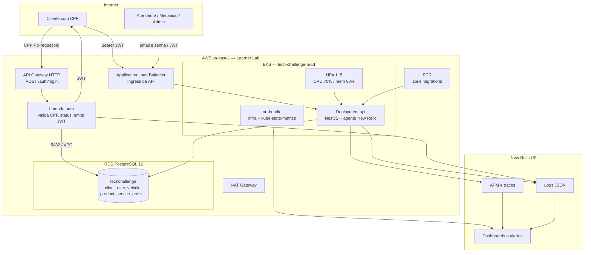

# Diagrama de componentes — visão de nuvem

Visão da Fase 3: nuvem AWS, API Gateway, Lambda, EKS, RDS PostgreSQL e New Relic.

## Componentes

| Componente | Repositório | Papel |
|---|---|---|
| API Gateway + Lambda | `lambda-auth` | Porta de autenticação do cliente |
| EKS, VPC, ALB, ECR, HPA | `infra-kubernetes` | Runtime da API e observabilidade de cluster |
| RDS PostgreSQL | `infra-database` | Banco gerenciado |
| API NestJS | `app` | Domínio, JWT interno, Swagger `/api` |
| New Relic | instrumentação em `app`, `lambda-auth` e Helm no `infra-kubernetes` | APM, logs, dashboards |

A API não passa pelo API Gateway. O tráfego de negócio entra pelo ALB. O gateway só autentica o cliente, conforme combinado para esta entrega.
