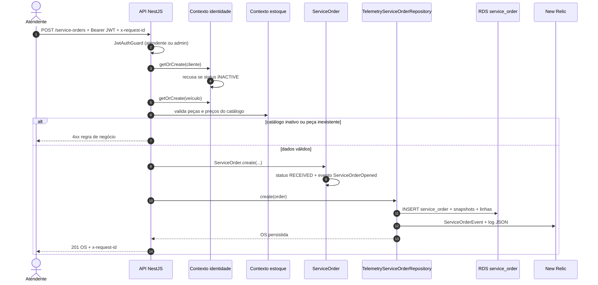

# Diagrama de sequência — abertura de ordem de serviço

Fluxo do atendente autenticado até a OS persistida e o evento de negócio no New Relic.

## O que a OS grava no RDS

Uma linha em `service_order`: FKs `client_id` / `vehicle_id`, snapshot (`client_name`, `vehicle_plate`, …) e JSONB `service_lines`, `part_lines`, `budget`, `status_history`. Não há tabelas filhas de linha/orçamento. Leitura posterior não faz JOIN com cadastro.

## Telemetria

`previousStatusDurationMs` só existe nas transições seguintes (diagnóstico → execução → finalização). A abertura emite `event = ServiceOrderOpened`, que alimenta o widget de volume diário.
