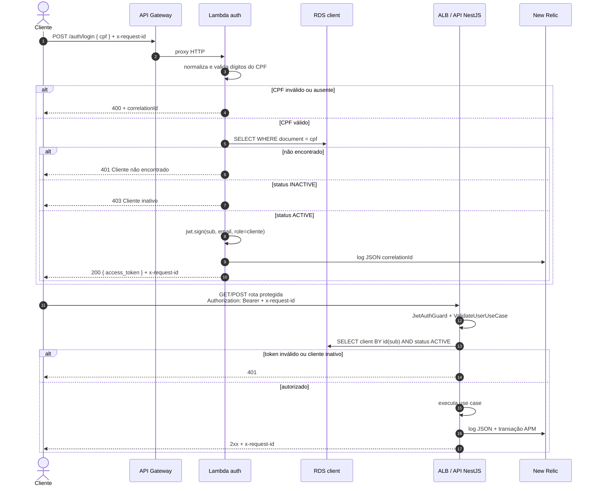

# Diagrama de sequência — autenticação por CPF

Fluxo do cliente até o consumo de uma rota protegida.

## Notas

- Usuário interno (`admin`, `atendente`…) autentica em `POST /auth/login` **da API**, com e-mail e senha. Esse caminho não passa pela Lambda.
- O `JWT_SECRET` da function e o do Deployment precisam ser o mesmo.
- Lambda e API usam o mesmo RDS via `DATABASE_URL` (rede privada da VPC).
