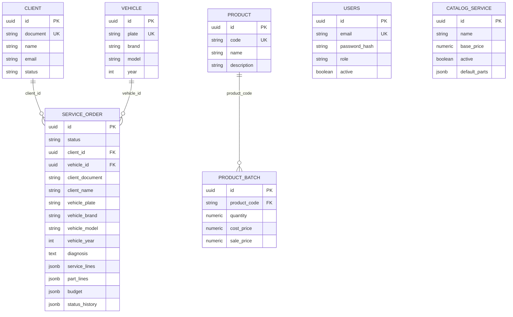

# Modelo de dados — oficina mecânica (PostgreSQL RDS)

## 1. Objetivo

Descrever o que está no **Amazon RDS PostgreSQL** (`techchallenge`): tabelas, FKs, snapshots da ordem de serviço e por que o agregado da OS usa JSONB. Justificativa do motor: [RFC-002](rfc/002-escolha-do-postgresql-rds.md). Schema versionado em `migrations/sql/001_schema.sql`.

Instância: `tech-challenge-prod-pg` (`infra-database`). Sem acesso público; API e Lambda entram pela VPC.

## 2. O que o avaliador vê no banco

Sete tabelas. **Não existem** tabelas `service_order_line`, `service_order_part` nem `service_order_budget`. Linhas, peças, orçamento e histórico da OS são JSONB **na própria** `service_order`.

| Tabela | Papel |
|---|---|
| `users` | Equipe (e-mail/senha). Nome no SQL: `users`, não `user`. |
| `client` | Cliente da oficina. A Lambda autentica por `document`. |
| `vehicle` | Veículo (placa única). Sem FK para `client`. |
| `product` | Peça do catálogo. |
| `product_batch` | Lote / estoque da peça. |
| `catalog_service` | Serviço vendável. Peças padrão em `default_parts` (JSONB). |
| `service_order` | Agregado da OS: FKs + snapshot + JSONB do atendimento. |

## 3. Diagrama (físico — o que existe no RDS)



`users` não tem FK para o restante: autentica a equipe, não faz parte do agregado da OS.

## 4. Por que JSONB na OS (e tabelas no cadastro)

Cadastro (`client`, `vehicle`, `product`, `catalog_service`) é relacional clássico: UNIQUE, FK, uma linha por entidade, consultado pela Lambda e pela API.

A ordem de serviço é **um agregado**: abre, diagnostica, orça e muda de status numa transação. Preço e nome do dia precisam ficar congelados (snapshot). Por isso:

- `client_id` / `vehicle_id` — FK `ON DELETE RESTRICT` (integridade, consulta por cadastro).
- `client_name`, `client_document`, `vehicle_plate`, … — cópia na abertura (não muda se o cliente alterar o nome depois).
- `service_lines`, `part_lines`, `budget`, `status_history` — JSONB na mesma linha. Uma leitura devolve a OS inteira, sem JOIN. O histórico de status alimenta o New Relic (`previousStatusDurationMs`) a partir do domínio, não de uma tabela extra.

Isso **é o modelo persistido**. O domínio NestJS continua com entidades ricas; o adapter TypeORM serializa o agregado nessas colunas.

## 5. Tabelas em detalhe

### 5.1 `users`

Papéis: `admin`, `atendente`, `estoquista`, `mecanico`. Senha bcrypt. `active` bloqueia JWT. Login: `POST /auth/login` da API (e-mail/senha). Não usa CPF.

### 5.2 `client`

`document` (CPF/CNPJ) único. `status`: `ACTIVE` ou `INACTIVE`. Lambda e `ValidateUserUseCase` recusam inativo. Seed de demo: CPF `52998224725`.

### 5.3 `vehicle`

Placa única. Cliente e veículo só se encontram na OS (`service_order.client_id` + `vehicle_id`).

### 5.4 `product` e `product_batch`

Peça e lote. FK `product_batch.product_code` → `product.code`. Preço de venda vive no lote (`sale_price`); a OS copia o valor para `part_lines` na geração do orçamento.

### 5.5 `catalog_service`

`default_parts` JSONB: `[{ "productCode", "quantity" }, …]`. Serviço inativo não entra em OS nova.

### 5.6 `service_order`

Status: `RECEIVED` → `IN_DIAGNOSIS` → `WAITING_APPROVAL` → `IN_EXECUTION` → `FINISHED` → `DELIVERED` (ou `CANCELLED`). Único ponto de mudança: `ServiceOrder.transitionTo`.

Consultar no RDS (túnel/DBeaver ou `psql` na VPC):

```sql
SELECT id, status, client_document, vehicle_plate, diagnosis, budget
FROM service_order
ORDER BY created_at DESC
LIMIT 20;
```

O console AWS (RDS → instância) **não** lista essas linhas.

## 6. Relacionamentos

| De | Para | Tipo | Onde está |
|---|---|---|---|
| `product` → `product_batch` | 1:N | FK `product_code` |
| `client` → `service_order` | 1:N | FK `client_id` + colunas snapshot |
| `vehicle` → `service_order` | 1:N | FK `vehicle_id` + colunas snapshot |
| `catalog_service` → linhas da OS | 1:N lógico | `service_lines` JSONB (id + nome + preço copiados) |
| `product` → peças da OS | 1:N lógico | `part_lines` JSONB |
| `users` | — | sem FK para OS |

## 7. Consistência e desempenho

1. Snapshot na abertura (`OpenServiceOrderUseCase`): FK + colunas copiadas no mesmo `INSERT`.
2. CPF, placa e e-mail normalizados na aplicação (`DocumentVO`, `PlateVO`, `EmailVO`).
3. Inativo não recebe JWT; OS antigas permanecem.
4. UNIQUE em `client.document`, `vehicle.plate`, `users.email`, `product.code`.
5. Índice em `service_order.status` e em `client_document` / `vehicle_plate`.
6. Leitura da OS = um `SELECT` na raiz; cadastro não entra no JOIN do atendimento.
