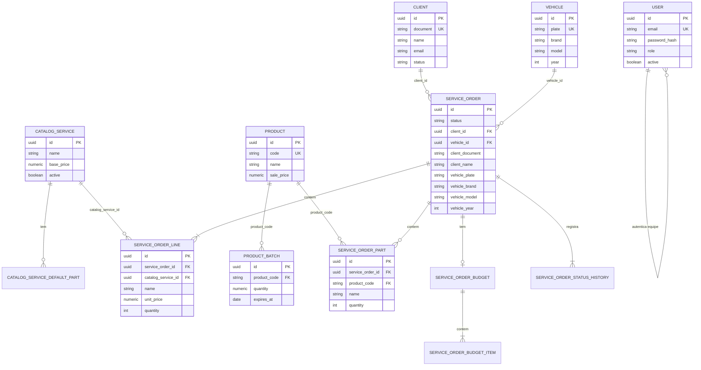

# Modelo de dados — oficina mecânica (PostgreSQL RDS)

## 1. Objetivo

Descrever o modelo relacional persistido no **Amazon RDS PostgreSQL** (`techchallenge`), os relacionamentos, snapshots da ordem de serviço e os ajustes de consistência e desempenho exigidos pelo Tech Challenge Fase 3.

## 2. Escolha do banco

RDS PostgreSQL 16, instância `tech-challenge-prod-pg`, provisionada pelo repositório `infra-database`. Justificativa na [RFC-002](rfc/002-escolha-do-postgresql-rds.md).

## 3. Diagrama entidade-relacionamento

## 4. Tabelas e responsabilidades

### 4.1 `user`

Equipe interna. Papéis: `admin`, `atendente`, `estoquista`, `mecanico`. Senha com bcrypt. Campo `active` bloqueia JWT. Autenticação por e-mail/senha na API — não usa CPF.

### 4.2 `client`

Cadastro da oficina. `document` (CPF/CNPJ) único e imutável. `status`: `ACTIVE` ou `INACTIVE`. Lambda e `ValidateUserUseCase` recusam inativo.

### 4.3 `vehicle`

Placa única. **Não há FK para `client` no código atual** — cliente e veículo só se relacionam quando uma OS é aberta (via `service_order.client_id` e `service_order.vehicle_id`).

### 4.4 `product` e `product_batch`

Catálogo de peça e lote. FK `product_batch.product_code` → `product.code`.

### 4.5 `catalog_service` e `catalog_service_default_part`

Serviço vendável. Peças sugeridas em tabela filha `catalog_service_default_part`.

### 4.6 `service_order` — agregado raiz

Status: `RECEIVED`, `IN_DIAGNOSIS`, `WAITING_APPROVAL`, `IN_EXECUTION`, `FINISHED`, `DELIVERED`, `CANCELLED`.

| Coluna | Tipo | Por quê |
|---|---|---|
| `client_id`, `vehicle_id` | FK | Filtrar OS por cadastro; integridade referencial |
| `client_document`, `client_name`, … | snapshot | Valores do dia da abertura — não mudam se o cliente casar depois |
| Linhas, orçamento, histórico | tabelas filhas | 1:N com `service_order_id` |

## 5. Relacionamentos

| De | Para | Tipo | Materialização |
|---|---|---|---|
| `product` → `product_batch` | 1:N | FK `product_code` |
| `catalog_service` → `catalog_service_default_part` | 1:N | FK `catalog_service_id` |
| `client` → `service_order` | 1:N | FK `client_id` + snapshot |
| `vehicle` → `service_order` | 1:N | FK `vehicle_id` + snapshot |
| `catalog_service` → `service_order_line` | 1:N | FK `catalog_service_id` + cópia de nome/preço |
| `product` → `service_order_part` | 1:N | FK `product_code` + cópia de nome |
| `service_order` → filhos | 1:N | `service_order_id` |
| `user` | — | sem FK para OS |

**Regra de snapshot:** leitura do atendimento usa colunas copiadas na OS, não JOIN com cadastro. FK serve para consultas e integridade; `ON DELETE RESTRICT` em `client_id`/`vehicle_id`.

## 6. Ajustes de consistência

1. **Snapshot na abertura.** `OpenServiceOrderUseCase` grava FK + colunas copiadas antes do `INSERT` das linhas.
2. **Valores de objeto.** CPF/CNPJ, placa e e-mail normalizados na aplicação (`DocumentVO`, `PlateVO`, `EmailVO`).
3. **Máquina de estados.** `ServiceOrder.transitionTo` único ponto de mudança de status; histórico em `service_order_status_history`.
4. **Status do cliente.** Inativo não recebe JWT; cadastro permanece para OS antigas.
5. **Transação na abertura.** Valida catálogo e peças antes de `COMMIT`.

## 7. Ajustes de desempenho

1. **UNIQUE** em `client.document`, `vehicle.plate`, `user.email`, `product.code`.
2. **Índice** em `service_order.status` para filas da oficina.
3. **Leitura da OS** com JOINs só nas tabelas filhas (`line`, `part`, `budget_item`) — cadastro via snapshot, sem JOIN extra.
4. **Referência por código** nas peças da OS.
5. **Health checks** do kubelet filtrados no Pino (volume New Relic).

## 8. Checklist de adaptação (código)

| Área | Pendência |
|---|---|
| `app` | TypeORM/Prisma + `pg`; repositórios SQL; migrations SQL; testes; `DATABASE_URL` |
| `lambda-auth` | driver `pg`; `DATABASE_URL`; `SELECT` em `client` |
| `infra-kubernetes` | secret `DATABASE_URL`; Terraform e workflows |
| Documentação | este arquivo, RFC-002, diagramas, READMEs, RUNBOOK |
